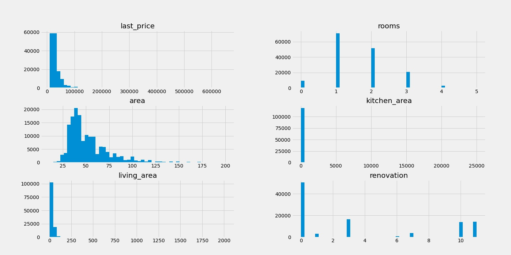

## Final project: E2E Sample ML course  

This document will be organized in the following way:
1.  Information about source data and some statistics
2.  Information about the models, choosen framework, hyperparams 
3.  How to install instructions and run an app with virtual environment (without a docker)
4.  Information about Dockerfile
5.  How to open the port in your remote VM
6.  How to run app using docker and which port it uses
 
### 1. Information about source data and some statistics
We use data from [Yandex.Realty](https://realty.yandex.ru) which contains real estate listings for apartments in **St. Petersburg only for rent** from 2016 till the middle of August 2018.

We have previously deleted outliers from the original detaset. Our dataset is available in the file named **spb.real.estate.archive.rent_cleaned_spb.tsv**. The code we used to work with the data is avaible in the file named **final_project_code**.

Let's have a look at all the variables we have in the dataset **that we use for further analysis.**

```python
<class 'pandas.core.frame.DataFrame'>
RangeIndex: 155890 entries, 0 to 155889
Data columns (total 7 columns):
 #   Column        Non-Null Count   Dtype  
---  ------        --------------   -----  
 0   last_price    155890 non-null  float64
 1   open_plan     155890 non-null  bool   
 2   rooms         155890 non-null  int64  
 3   area          155890 non-null  float64
 4   kitchen_area  118764 non-null  float64
 5   living_area   123431 non-null  float64
 6   renovation    102998 non-null  float64
dtypes: bool(1), float64(5), int64(1)
memory usage: 7.3 MB
 ```
We see that there are some **nulls** for `kitchen_area`, `living_area`, and `renovation`. Apart from that, some of the datatypes are not correct: for instance, we will need to transform the datatype of the variable `open_plan` from bool to int and for `renovation` from float64 to int.
 
But before the proceed, let's have a look at some visualisation for acquiring a better understanding of the dataset.

#### Histograms 
We see that most quantitative variables seem to have a right-skewed distribution. Here let's also note that `renovation` is not per se a quantitave variable, it is a categorical variable, still we will treat it as a quantitave variable for the sake of simplicty.



#### Boxplots. Part 1
The dataset was previously cleaned from outliers, still some of them remain, especially for our target variable `last_price`. But we will use standatization techniques later, so it is okay to have some of the outliers left.


#### Boxplots. Part 2
Let's have a closer look at some of the variables: `floor`, `open_plan`, `rooms`, `renovation`. Here we should note that `open_plan` is a binary variable and `renovation` (in its nature) is a categorical variable.


#### Heatmap
We see that not all of the variables have a strong relationship with our target variable `last_price`: for example, `kitchen_area` or `renovation`. Still we will leave them in the sample for the sake of completing the task.


Let's fix now some issues with nulls and datatypes and have a look at the descriptive statistics before proceeding with the models.
```python
    rent_df_cleaned['open_plan'] = rent_df_cleaned['open_plan'].astype('int')
    rent_df_cleaned['renovation'] = rent_df_cleaned['renovation'].fillna(0)
    rent_df_cleaned['living_area'] = rent_df_cleaned['living_area'].fillna(0)
    rent_df_cleaned['kitchen_area'] = rent_df_cleaned['kitchen_area'].fillna(0)
    rent_df_cleaned['renovation'] = rent_df_cleaned['renovation'].astype('int')
   ```
Now, to the descriptive statistics:

|     | last_price| open_plan|     rooms| area      |kitchen_area|living_area| renovation|     
|:----|:---------:|:--------:|:--------:|:---------:|:----------:|:---------:|----------:|
|count|155890     |155890    |155890    |155890     |155890      |155890     |155890     | 
|mean |32605.0872 |0.0001    |1.6053    |53.6892    |8.8785      |24.2391    |2.4374     | 
|std  |24222.2159 |0.0072    |0.8790    |24.81189   |71.8455     |20.1062    |4.0441     | 
|min  |9900       |0         |0         |11         |0           |0          |0          | 
|25%  |20000      |0         |1         |38         |5           |16         |0          |
|50%  |25000      |0         |1         |46         |9           |20         |0          |
|75%  |35000      |0         |2         |62         |12          |34         |3          | 
|max  |650000     |1         |5         |200        |25000       |2015       |11         |

Surely some of the outliers are remaining, so there is **room for improvement**.

Later we break the dataset into train, validation, and holdout samples:

```python
    train_df = rent_df_cleaned[(rent_df_cleaned.first_day_exposition >= '2018-01-01') 
                              & (rent_df_cleaned.first_day_exposition < '2018-04-01')]

    test_df = rent_df_cleaned[(rent_df_cleaned.first_day_exposition >= '2018-04-01') 
                              & (rent_df_cleaned.first_day_exposition < '2018-06-01')]

    holdout_df = rent_df_cleaned[rent_df_cleaned.first_day_exposition >= '2018-06-01']
```
#### Applying StandardScalers
Next we create StandardScalers and apply them:

```python

    # creating standard scalers
    sc_y = StandardScaler()
    sc_x = StandardScaler()

    # creating the list of variables we will use in the model
    variables = ['last_price', 'open_plan', 'rooms', 'area', 'kitchen_area', 'living_area', 'renovation']

    # creating empty datasets/series
    y_train = pd.DataFrame(dtype='float64')
    X_train = pd.DataFrame()
    y_test = pd.DataFrame(dtype='float64')
    X_test = pd.DataFrame()

    # applying scalars

    for var in variables:
        if var == 'last_price':
            y_train[var] = sc_y.fit_transform(train_df[var].values.reshape(-1, 1)).flatten()
            y_test[var] = sc_y.fit_transform(test_df[var].values.reshape(-1, 1)).flatten()
        elif var == 'open_plan':
            X_train[var] = train_df[var].values.reshape(-1, 1).flatten()
            X_test[var] = test_df[var].values.reshape(-1, 1).flatten()
        else:
            X_train[var] = sc_x.fit_transform(train_df[var].values.reshape(-1, 1)).flatten()
            X_test[var] = sc_x.fit_transform(test_df[var].values.reshape(-1, 1)).flatten()
```

#### A look at X_train and y_train dataframes
Let's have a look at the transformed **X_train** dataset by calling `X_train.head()`:


|     | open_plan|     rooms| area      |kitchen_area|living_area| renovation|     
|:----|:--------:|:--------:|:---------:|:----------:|:---------:|----------:|
|0    |0         |-0.571269 |-0.601119  |-0.637516   |-1.108984  |-0.641025  | 
|1    |0         |-0.571269 |-0.793495  |-0.030875   |-0.082134  |-0.405288  | 
|2    |0         |-0.571269 |-0.504932  |0.055788    |-0.082134  |-0.641025  | 
|3    |0         |-0.571269 |-0.79349   |-0.637516   |-1.108984  |-0.641025  | 
|4    |0         |-0.571269 |-0.793495  |-0.030875   |0.031960   |-0.641025  |


And also for **y_train** by calling `y_train.head()`:

|     | last_price|
|:----|:---------:|
|0    |-0.096886  |
|1    |-0.531115  |
|2    |-0.607744  |
|3    |-0.301229  |
|4    |-0.403401  | 

### 2. Information about the models, choosen framework, hyperparams

We have decided to use **RandomForestRegressor** and **CatBoostRegressor** to build two different machine models with the same variables. 

We used the following algorithm (framework):
1.  Apply GridSearch to find the best parameters;
2.  Fit the model with the best parameters;
3.  Calculate the metrics for the model;
4.  Recreate scalars, apply them, import scalars and the models to .pkl files.

#### Random Forest Regressor

1. Apply GridSearch to find the best parameters:
```python
params = {'forest__n_estimators': [10, 100, 200],
          'forest__max_depth': [i for i in range(5, 36, 5)],
          'forest__min_samples_leaf': [1, 3, 10],
          'forest__max_features': [2, 1],
          'forest__min_samples_split' : [2, 3]
         }
```
```python
rt = Pipeline([('forest', RandomForestRegressor(random_state=0, bootstrap=True))])
```
```python
rt_cv = GridSearchCV(estimator=rt, param_grid=params, scoring='neg_root_mean_squared_error', cv=5, refit=True, 
                     n_jobs=1,
                     verbose=2)
```
```python
rt_cv.fit(X_train, y_train.values.ravel())
```

2.  Fit the model with the best parameters:

```python
# evaluating the random forest with the "best" parameters according to the results of GridSearch
forest = RandomForestRegressor(max_depth=10, random_state=0, max_features=1, min_samples_leaf=3, min_samples_split=2,
                              n_estimators=100)
forest.fit(X_train, y_train.values.ravel())
```

3.  Calculate the metrics for the model:
We calculate the metrics using some simple user defined functions:
```python
Train sample RMSE: 0.54
Train sample MSE: 0.29
Train sample MAE: 0.28
```
```python
Validation sample RMSE: 0.64
Validation sample MSE: 0.41
Validation sample MAE: 0.31
```

#### CatBoost Regressor

1. Apply GridSearch to find the best parameters:
```python
# Let's try to apply Gridsearch with CatBoost Regressor
params = {'catboost__iterations': [1500, 2500],
          'catboost__depth': [i for i in range(6, 11, 2)],
          'catboost__learning_rate': [i for i in np.arange(0.03, 0.10, 0.03)]
         }
```
```python
cb = Pipeline([('catboost', CatBoostRegressor(random_seed=1234, logging_level='Silent', thread_count=10))])
```
```python
cb_cv = GridSearchCV(estimator=cb, param_grid=params, scoring='neg_root_mean_squared_error', cv=5, refit=True, 
                     n_jobs=1,
                     verbose=2)
```
```python
cb_cv.fit(X_train, y_train)
```

2.  Fit the model with the best parameters:
    
```python
# evaluating the catboost with the "best" parameters according to the results of GridSearch
catboost_model = CatBoostRegressor(iterations=1500, 
                                 depth=8,
                                 learning_rate=0.03,
                                 logging_level='Silent',
                                 thread_count=10,
                                 random_seed=1234)
catboost_model.fit(X_train, y_train)
```

3. Calculate the metrics for the model:

```python
Train sample RMSE: 0.41
Train sample MSE: 0.16
Train sample MAE: 0.26
```
```python
Validation sample RMSE: 0.70
Validation sample MSE: 0.49
Validation sample MAE: 0.32
```
In both models some degree of **overfitting** is presented, but it is more prominent for the CatBoost Regressor.

4. Recreate scalars, apply them, import scalars and the models to .pkl files
We skip the process of scalars' recreation, reapplication, and reassessment of the models here since it is quite straight-foward. Here is how we downloaded the files:

#### Random Forest Regressor
```python
rf_model_file = 'rf_model.pkl'
scaler_x = 'scaler_x.pkl'
scaler_y = 'scaler_y.pkl'
joblib.dump(sc_x, scaler_x)
joblib.dump(sc_y, scaler_y)
joblib.dump(forest, rf_model_file)
```
#### CatBoost Regressor
```python
cb_model_file = 'cb_model.pkl'
joblib.dump(catboost_model, cb_model_file)
```

### 3. How to install instructions and run an app with virtual environment (without a docker)

Once you have created and connected to your VM, you can create you virtual environment **(without a docker)**:
1. `sudo apt install python3.8-venv`
2. `python3 -m venv env`
3. `source env/bin/activate`

You will also need to initialize a git repository in your virtual environment. To do this, you need to run:
1. `sudo apt install git` 
2. `git init`
3. `git add .` 
4. `git commit -m 'Any message'`

Now you can pull the files from this **repository**. Afterwards you will need to install requirements from **requirements.txt** file by executing: `pip install -r requirements.txt`. It may ask you to install pip, which is totally okay. 

You may also install libraries manually using `pip install <library">`. You will need `numpy`, `Flask`, `sklearn`, `pandas`, `joblib`, and `catboost`.

Now you will need to use a `sudo ufw allow 6262`, there 6262 is the `number of the port` used in the application. You can change it if you want. Now you can run the application using `python3 app_new.py`. 

You can go to [Postman](https://www.postman.com/) and try creating an HTTP-request there.

Your request should include: `<your_public_IP>:6262/predict_price` and you should also specify the parameters you want to use in the following order:
1. model version (1 for Random Forest Regressor, 2 for CatBoost Regressor)
2. open_plan (0 or 1)
3. area (any reasonable number)
4. kitchen_area (any reasonable number)
5. living_area (any reasonable number)
6. renovation (any int number from 0 to 11)

Notice that if you do not specify some parameter, you will get an exception: `ex.500 Internal server error`

### 4. Information about Dockerfile

You may want to have a look at **Dockerfile** in the repository. 
```linux
from ubuntu:20.04 
MAINTAINER Lilomilo
RUN apt-get update -y
COPY . /opt/predict_price
WORKDIR /opt/predict_price
RUN apt install -y python3-pip
RUN pip3 install -r requirements.txt
CMD python3 app_new.py
```
We used `ubuntu` image to create our docker containers. Basically this code updates the current versions of the packages, copies all the content (except those files specified in our `.dockerignore` file), creates a working directory `predict_price`, installs a `python3` virtual environment, installs all the required libraries stored in `requirements.txt`, and runs an application `app_new.py`.

### 5. How to open a port in your VM
If you want to open a port in your VM, you need to use the following code: `sudo ufw allow <number of the port>` you wish to open. The port number should be the same one you use in your version of the application.

If this port is already in use, you might want to use `htop` in order to stop the process that uses the port. You might need to install `htop` using `sudo apt install htop` before that.

### 6. How to run app using docker and which port it uses
Our docker is located [here](https://hub.docker.com/r/lilomilo/predict_price) at [Docker Hub](https://hub.docker.com/).

If you want to use it for running an application, you will first need to install docker at your VM using these links:
1. Install docker engine: https://docs.docker.com/engine/install/ubuntu/
2. Post-installation steps for Linux: https://docs.docker.com/engine/install/linux-postinstall/

Now you can use `docker pull lilomilo/predict_price:v.0.3` to pull the container to your machine. Use the following command: `docker run -network host -d lilomilo/predict_price:v.0.3` to run the container. 

Now you can go to [Postman](https://www.postman.com/) and try creating an HTTP-request there.

Your request should include `<your_public_IP>:6262/predict_price` and you should also specify the parameters you want to use in the following order:
1. model version (1 for Random Forest Regressor, 2 for CatBoost Regressor)
2. open_plan (0 or 1)
3. area (any reasonable number)
4. kitchen_area (any reasonable number)
5. living_area (any reasonable number)
6. renovation (any int number from 0 to 11)

You may want to change the number of the port, see 5. How to open a port in your VM for that.

#### Notes
Currently the application is avaliable via this HTTP-request:
`51.250.103.254:6262/predict_price?model_version=2&open_plan=1&rooms=2&area=34&kitchen_area=0&living_area=2&renovation=3`

You may change the parameters of the request.
